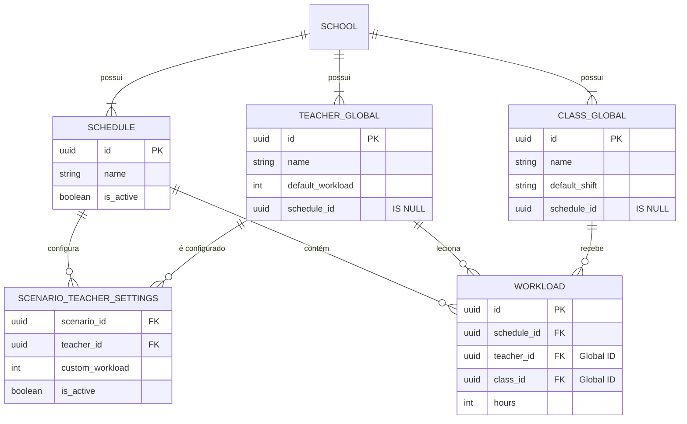

# 🏗️ Arquitetura de Banco de Dados V2 (Layered Architecture)

Este documento descreve a nova estrutura do banco de dados do ChatHorário, implementada em **Dezembro de 2025**. A principal mudança foi a transição de uma arquitetura de "Deep Clone" (duplicação total) para uma **Arquitetura em Camadas (Global vs. Cenário)**.

---

## 📐 Conceito Principal

O sistema agora divide os dados em três camadas de existência:

### 1. 🌍 Camada Global (A "Verdade")
Entidades que existem independentemente de cenários. Elas representam o cadastro "físico" da escola.
*   **Tabelas:** `teachers`, `subjects`, `classes`, `curriculum_matrices`.
*   **Característica:** `schedule_id` é sempre `NULL`.
*   **Comportamento:** Se você corrige o nome de um professor aqui, corrige em **todos** os cenários.

### 2. ⚙️ Camada de Configuração (O "Contexto")
Define como uma entidade global se comporta dentro de um cenário específico.
*   **Tabelas:** `scenario_teacher_settings`, `scenario_class_settings`.
*   **Característica:** Vincula `scenario_id` + `entity_id` (Global).
*   **Exemplo:** O professor "João" (Global) tem carga horária de 20h, mas no "Cenário A" (Settings) ele tem 24h.

### 3. 📅 Camada Operacional (O "Resultado")
Dados gerados pela alocação e distribuição de aulas.
*   **Tabelas:** `workloads`, `fixed_lessons`, `teacher_availability`, `schedules` (antiga `schedule_scenarios`).
*   **Característica:** Possuem `schedule_id` preenchido e apontam para IDs Globais.

---

## 📊 Diagrama de Entidade-Relacionamento (Simplificado)

---

## 🔄 Fluxos de Trabalho

### 1. Criação de Novo Cenário
Quando você cria um cenário do zero:
1.  Um novo registro é inserido na tabela `schedules`.
2.  **Nenhum** professor ou turma é duplicado.
3.  O sistema exibe os dados globais. Se você editar uma carga horária neste cenário, um registro é criado em `scenario_teacher_settings`.

### 2. Duplicação (Clonagem)
Quando você clica em "Duplicar Cenário":
1.  A função `clone_schedule_scenario` (PostgreSQL) é chamada.
2.  Ela cria um novo `schedule_id`.
3.  Ela **COPIA** as configurações (`scenario_teacher_settings`) do cenário original para o novo.
4.  Ela **COPIA** as alocações (`workloads`, `fixed_lessons`) do cenário original para o novo, mantendo os ponteiros para os mesmos professores globais.
*   **Resultado:** Clonagem instantânea (< 100ms) e sem redundância de dados cadastrais.

### 3. Importação de Backup (JSON)
*(Nota: O fluxo de importação ainda pode precisar de ajustes para lidar perfeitamente com a deduplicação global, mas a lógica ideal é:)*
1.  O sistema lê o JSON.
2.  Tenta encontrar professores/turmas pelo nome na base Global.
    *   Se encontrar: Usa o ID existente.
    *   Se não encontrar: Cria um novo registro Global.
3.  Insere as alocações (`workloads`) vinculando aos IDs Globais encontrados/criados.
4.  Insere as configurações específicas do backup nas tabelas de settings.

---

## 🛡️ Vantagens da Nova Arquitetura

1.  **Consistência:** Corrigir um erro de digitação no nome de um professor corrige em todo o histórico.
2.  **Performance:** Consultas mais leves, backups menores e clonagem instantânea.
3.  **Inteligência:** Permite comparar facilmente a evolução da carga horária de um professor entre diferentes cenários (basta fazer um JOIN simples, pois o `teacher_id` é o mesmo).
4.  **Manutenibilidade:** Fim dos "IDs fantasmas" e dados órfãos.

---

**Documento gerado automaticamente pela Equipe de Engenharia.**
