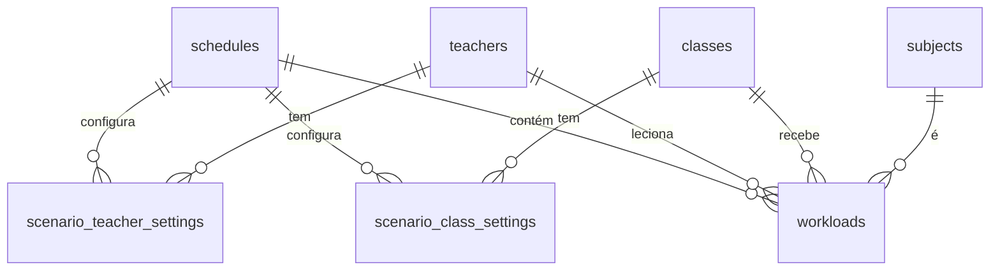

# 🗄️ Esquema do Banco de Dados V2 (Pós-Refatoração)

Este documento detalha a estrutura do banco de dados após a migração para a **Arquitetura em Camadas (Layered Architecture)** realizada em Dezembro de 2025.

---

## 1. Tabelas Principais (Core)

### `schools`
Tabela raiz que agrupa todos os dados de uma instituição.
- `id` (UUID, PK)
- `name` (TEXT)
- `created_at` (TIMESTAMPTZ)

### `schedules` (Cenários)
Representa um cenário de grade horária (ex: "Versão Final 2025", "Simulação A").
- `id` (UUID, PK)
- `school_id` (UUID, FK -> schools)
- `name` (TEXT)
- `description` (TEXT)
- `is_active` (BOOLEAN): Indica se é o cenário atualmente em uso/visualização.
- `snapshot_data` (JSONB): Dados congelados para histórico.
- `created_at` (TIMESTAMPTZ)

---

## 2. Entidades Globais (Global Layer)
Dados cadastrais únicos por escola. **Não dependem de cenário.**

### `teachers`
- `id` (UUID, PK)
- `school_id` (UUID, FK -> schools)
- `name` (TEXT)
- `email` (TEXT)
- `workload_total` (INT): Carga horária padrão/contratual.
- `schedule_id` (UUID): **DEPRECATED/NULL** (Mantido como NULL para compatibilidade legada, mas não usado para vínculo).

### `classes`
- `id` (UUID, PK)
- `school_id` (UUID, FK -> schools)
- `name` (TEXT)
- `grade` (TEXT): Usado frequentemente para armazenar o Turno ou Série.
- `schedule_id` (UUID): **DEPRECATED/NULL**.

### `subjects`
- `id` (UUID, PK)
- `school_id` (UUID, FK -> schools)
- `name` (TEXT)
- `short_name` (TEXT)
- `schedule_id` (UUID): **DEPRECATED/NULL**.

---

## 3. Configurações de Cenário (Settings Layer)
Personalizações das entidades globais para um cenário específico.

### `scenario_teacher_settings`
- `id` (UUID, PK)
- `scenario_id` (UUID, FK -> schedules)
- `teacher_id` (UUID, FK -> teachers)
- `custom_workload` (INT): Sobrescreve `teachers.workload_total` neste cenário.
- `is_active` (BOOLEAN): Se false, o professor é ignorado neste cenário.

### `scenario_class_settings`
- `id` (UUID, PK)
- `scenario_id` (UUID, FK -> schedules)
- `class_id` (UUID, FK -> classes)
- `turn_override` (TEXT): Sobrescreve `classes.grade` (turno) neste cenário.
- `is_active` (BOOLEAN): Se false, a turma é ignorada neste cenário.

---

## 4. Dados Operacionais (Operational Layer)
Dados que compõem a grade horária em si. Pertencem a um cenário e apontam para globais.

### `workloads` (Atribuições de Aulas)
- `id` (UUID, PK)
- `schedule_id` (UUID, FK -> schedules)
- `school_id` (UUID, FK -> schools)
- `teacher_id` (UUID, FK -> teachers)
- `subject_id` (UUID, FK -> subjects)
- `class_id` (UUID, FK -> classes)
- `hours` (INT): Quantidade de aulas.

### `teacher_availability`
- `id` (UUID, PK)
- `schedule_id` (UUID, FK -> schedules)
- `teacher_id` (UUID, FK -> teachers)
- `day_of_week` (INT): 0-6 (Dom-Sab) ou 1-5 (Seg-Sex).
- `time_slot_index` (INT): Índice da aula no dia.
- `status` (TEXT/INT): Disponível, Indisponível, Preferencial.

### `fixed_lessons`
- `id` (UUID, PK)
- `schedule_id` (UUID, FK -> schedules)
- `class_id` (UUID, FK -> classes)
- `teacher_id` (UUID, FK -> teachers)
- `subject_id` (UUID, FK -> subjects)
- `day_of_week` (INT)
- `slot_number` (INT)

---

## 5. Diagrama Relacional (Mermaid)

