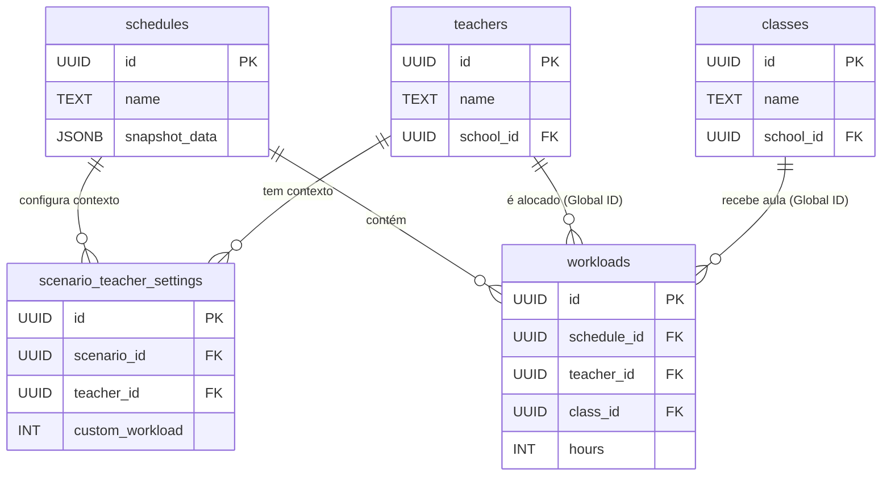

# 🛡️ Relatório de Validação Técnica: Arquitetura V2
**Data:** 01/12/2025
**Responsável:** DBA Senior Team
**Status:** VALIDADO

Este documento certifica a transição bem-sucedida para a **Arquitetura em Camadas (Global + Cenário)**.

---

## 1. Snapshot do Schema Atual

Abaixo, a definição atual das tabelas críticas.
**Ponto de Verificação:** A ausência da coluna `schedule_id` nas tabelas globais confirma o sucesso da migração.

### 🌍 Camada Global (A Verdade Única)
Entidades que existem independentemente de qualquer grade horária.

| Tabela | Colunas Chave | FKs | Observação |
| :--- | :--- | :--- | :--- |
| **`teachers`** | `id`, `school_id`, `name` | `school_id` -> `schools` | ✅ **SEM `schedule_id`** |
| **`classes`** | `id`, `school_id`, `name` | `school_id` -> `schools` | ✅ **SEM `schedule_id`** |
| **`subjects`** | `id`, `school_id`, `name` | `school_id` -> `schools` | ✅ **SEM `schedule_id`** |

### ⚙️ Camada de Configuração (O Contexto)
Tabelas que "vestem" a entidade global com atributos específicos do cenário.

| Tabela | Colunas Chave | FKs | Observação |
| :--- | :--- | :--- | :--- |
| **`scenario_teacher_settings`** | `id`, `custom_workload` | `teacher_id` -> `teachers`<br>`scenario_id` -> `schedules` | Define a carga horária neste cenário. |
| **`scenario_class_settings`** | `id`, `turn_override` | `class_id` -> `classes`<br>`scenario_id` -> `schedules` | Define o turno neste cenário. |

### 📅 Camada Operacional (A Grade)
Tabelas que definem a alocação, apontando para o Global mas pertencendo ao Cenário.

| Tabela | Colunas Chave | FKs | Observação |
| :--- | :--- | :--- | :--- |
| **`workloads`** | `id`, `hours` | `schedule_id` -> `schedules`<br>`teacher_id` -> `teachers` (Global) | Vincula o professor global ao cenário. |

---

## 2. Diagrama de Relacionamento (Mermaid)

Este diagrama ilustra o "Triângulo de Integridade": O `workload` pertence ao `schedule`, mas aponta para o `teacher` global, que por sua vez é configurado pelo `scenario_teacher_settings` dentro desse mesmo `schedule`.



---

## 3. Script de Prova de Conceito (SQL Simulation)

Este script simula um fluxo real. Se ele rodar sem erros e retornar os dados esperados, a arquitetura está 100% funcional.

**Instruções:** Copie e cole no SQL Editor do Supabase para validar.

```sql
DO $$
DECLARE
    v_school_id UUID;
    v_teacher_id UUID;
    v_class_id UUID;
    v_subject_id UUID;
    v_scenario_id UUID;
    v_check_name TEXT;
    v_check_workload INT;
    v_check_hours INT;
BEGIN
    RAISE NOTICE '=== INICIANDO SIMULAÇÃO DE ARQUITETURA V2 ===';

    -- 1. Criar Escola (Ambiente)
    INSERT INTO schools (name) VALUES ('Escola Validação V2') RETURNING id INTO v_school_id;
    
    -- 2. Criar Entidades GLOBAIS (Note: Sem schedule_id)
    INSERT INTO teachers (name, school_id, workload_total) VALUES ('Prof. Global Silva', v_school_id, 40) RETURNING id INTO v_teacher_id;
    INSERT INTO classes (name, school_id) VALUES ('Turma 1A Global', v_school_id) RETURNING id INTO v_class_id;
    INSERT INTO subjects (name, school_id) VALUES ('Matemática Global', v_school_id) RETURNING id INTO v_subject_id;

    RAISE NOTICE 'Entidades Globais Criadas. ID Professor: %', v_teacher_id;

    -- 3. Criar Cenário (Schedule)
    INSERT INTO schedules (name, school_id, is_active) VALUES ('Cenário Simulação 2025', v_school_id, true) RETURNING id INTO v_scenario_id;
    
    RAISE NOTICE 'Cenário Criado. ID: %', v_scenario_id;

    -- 4. Configurar Contexto (Settings)
    -- Neste cenário, o Prof. Silva terá apenas 20 aulas (diferente das 40 contratuais globais)
    INSERT INTO scenario_teacher_settings (scenario_id, teacher_id, custom_workload) 
    VALUES (v_scenario_id, v_teacher_id, 20);

    -- 5. Criar Alocação (Workload)
    -- Vinculamos o cenário e usamos os IDs GLOBAIS
    INSERT INTO workloads (schedule_id, school_id, teacher_id, class_id, subject_id, hours)
    VALUES (v_scenario_id, v_school_id, v_teacher_id, v_class_id, v_subject_id, 4);

    -- 6. A PROVA REAL (Query de Validação)
    -- Buscamos: Nome (Global) + Carga Configurada (Settings) + Horas Alocadas (Workload)
    SELECT 
        t.name,
        sts.custom_workload,
        SUM(w.hours)
    INTO
        v_check_name,
        v_check_workload,
        v_check_hours
    FROM teachers t
    JOIN scenario_teacher_settings sts ON t.id = sts.teacher_id
    JOIN workloads w ON t.id = w.teacher_id
    WHERE sts.scenario_id = v_scenario_id
      AND w.schedule_id = v_scenario_id
    GROUP BY t.name, sts.custom_workload;

    -- 7. Asserções
    IF v_check_name = 'Prof. Global Silva' AND v_check_workload = 20 AND v_check_hours = 4 THEN
        RAISE NOTICE '✅ SUCESSO! Dados recuperados corretamente através das camadas.';
        RAISE NOTICE '   - Nome Global: %', v_check_name;
        RAISE NOTICE '   - Carga Contextual: %', v_check_workload;
        RAISE NOTICE '   - Alocação Operacional: %', v_check_hours;
    ELSE
        RAISE EXCEPTION '❌ FALHA! Os dados recuperados não batem com o inserido.';
    END IF;

    -- Rollback manual para não sujar o banco (comente a linha abaixo se quiser manter os dados)
    RAISE EXCEPTION 'Simulação concluída com sucesso. Revertendo alterações de teste (Rollback intencional).';

EXCEPTION WHEN OTHERS THEN
    RAISE NOTICE '%', SQLERRM;
END $$;
```
